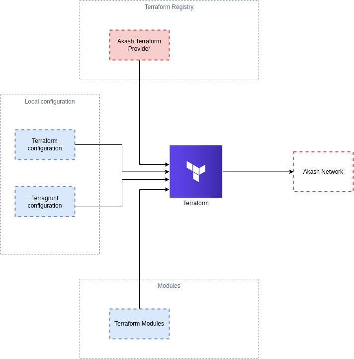

# Terraform Provider Akash



## Pre-requisites
For the provider to work properly you'll need:

- Terraform
- Go 1.18
- Akash v0.16.3
- (mac users) realpath, which can be installed using:
```shell
brew install coreutils
```

## Installation

You can visit the [registry](https://registry.terraform.io/providers/joao-luna-98/akash/latest) and follow the installations steps.

**or**

Move the binary file of the provider (check releases) to the following folder:
```shell
mkdir -p ~/.terraform.d/plugins/joaoluna.com/cloud/akash/<version>/<OS arch e.g. darwin_arm64>
mv <binary> ~/.terraform.d/plugins/joaoluna.com/cloud/akash/<version>/<OS arch e.g. darwin_arm64>
```

## Usage

### Environment Variables
Make sure you have the following environment variables in your machine in order for the provider to work correctly.

| Variable                | Description                                                      |
|-------------------------|------------------------------------------------------------------|
| `AKASH_KEY_NAME`        | Name of your keychain.                                           |
| `AKASH_KEYRING_BACKEND` | Backend of the keyring.                                          |
| `AKASH_ACCOUNT_ADDRESS` | Address of your account.                                         |
| `AKASH_NET`             | Network to use, usually the mainnet.                             |
| `AKASH_VERSION`         | Version of the network.                                          |
| `AKASH_CHAIN_ID`        | Chain id of the network.                                         |
| `AKASH_NODE`            | Akash node to connect to.                                        |
| `AKASH_HOME`            | Absolute path to the Akash's home folder, usually under ~/.akash |
| `AKASH_PATH`            | (Optional) The path to the Akash binary                          |

In alternative, you can pass these as the configuration of the provider

### Import current state
To import your existing deployments to your `tfstate` you have to build the id of your deployment which consists of the dseq, your address and the provider's address separated by ":".
```shell
terraform import akash_deployment.<resource_name> <dseq>:<your address>:<providers address>
```

### How to install
To install the Terraform provider through the source code execute the two following commands from your shell:
```shell
go build -o terraform-provider-akash
make install
```

### Example configurations
You can find example configurations for creating a deployment inside the `examples/` folder.

## Development environment setup

```shell
export AKASH_KEY_NAME=terraform
export AKASH_KEYRING_BACKEND=os
export AKASH_ACCOUNT_ADDRESS="$(provider-services keys show $AKASH_KEY_NAME -a)"
export AKASH_NET="https://raw.githubusercontent.com/ovrclk/net/master/mainnet"
export AKASH_VERSION="$(curl -s "$AKASH_NET/version.txt")"
export AKASH_CHAIN_ID="$(curl -s "$AKASH_NET/chain-id.txt")"
export AKASH_NODE="https://akash-rpc.polkachu.com:443"
export AKASH_HOME="$(realpath ~/.akash)"
export TF_LOG_PROVIDER=DEBUG
```

## Clean terraform
```shell
make clean
```

## Build the provider

Run the following command to build the provider

```shell
# Run the following command to build the provider
go build -o terraform-provider-akash

# Build and install the provider
make install

cd examples && terraform init && terraform apply --auto-approve
```

## Akash Testing

### Close the Deployment

```shell
provider-services tx deployment close --dseq 7878447 --owner $AKASH_ACCOUNT_ADDRESS --from $AKASH_KEY_NAME -y --gas=auto --gas-adjustment=1.15 --gas-prices=0.025uakt
```

### Get deployment details

```shell
provider-services provider lease-status --home ~/.akash --dseq 7339802 --provider akash1e5g55l6dqwdjewq4zenl6u93t2mmy2603pungd
```

### Get logs

```shell
provider-services provider lease-logs --dseq 7339802 --provider akash1e5g55l6dqwdjewq4zenl6u93t2mmy2603pungd --from "$AKASH_KEY_NAME"
```

## Troubleshooting

### `Error: error unmarshalling: invalid character '<' looking for beginning of value`
If you encounter this error close the deployment and try again.
If in development mode, try to increase the fees on deployment creation.
